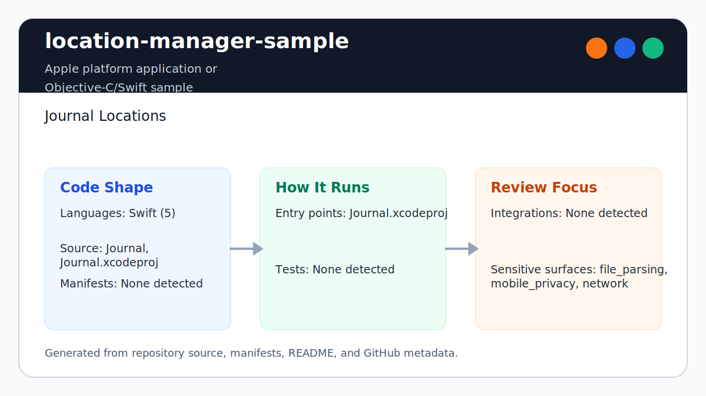

# location-manager-sample

<!-- README-OVERVIEW-IMAGE -->


## Overview

`garethpaul/location-manager-sample` is an Apple platform application or Objective-C/Swift sample. Journal Locations

This README is based on the checked-in source, manifests, scripts, and repository metadata on the `master` branch. The project language mix found during review was: Swift (5).

## Repository Contents

- `.gitignore` - generated Xcode/Finder metadata and local config ignores
- `CHANGES.md` - recent maintenance changes
- `Makefile` - local static verification entry point
- `Journal` - source or example code
- `Journal.xcodeproj` - Xcode project file
- `Route.gpx` - simulator route fixture for location testing
- `SECURITY.md` - security reporting and disclosure guidance
- `VISION.md` - project direction and maintenance guardrails
- `scripts/check-baseline.py` - static baseline checks for storage, project files, assets, and docs

Additional scan context:

- Source directories: Journal, Journal.xcodeproj, scripts
- Dependency and build manifests: Makefile
- Entry points or build surfaces: `make lint`, `make test`, `make build`, `make check`, Journal.xcodeproj
- Test-looking files: no obvious test files detected

## Getting Started

### Prerequisites

- Git
- Python 3 for `make lint`, `make test`, `make build`, and `make check`
- macOS with Xcode for building Apple platform projects

### Setup

```bash
git clone https://github.com/garethpaul/location-manager-sample.git
cd location-manager-sample
make lint
make test
make build
make check
```

The setup commands above are derived from repository files. Legacy mobile, Python, or JavaScript samples may require older SDKs or package versions than a modern workstation uses by default.

## Running or Using the Project

- Open `Journal.xcodeproj` in Xcode, choose the app or sample scheme, and run it on the matching simulator/device.
- The map and places views remove their saved-location notification observers when deallocated.
- Saved-location publishing uses main-thread notification delivery before UIKit or MapKit observers update.
- Location manager delegate setup happens before authorization and visit monitoring so early callbacks are handled.
- Fake visit simulation uses the latest location update from CoreLocation
  batches.
- The places table uses a table index guard before reading saved locations during cell rendering.
- Startup loading uses a saved-location JSON file filter before decoding local app documents.
- Startup loading accepts only regular JSON files up to 64 KiB, caps each file
  read before decode, and rejects decoded locations with invalid coordinates.
- Startup reads at most 1,000 newest eligible location JSON files across legacy
  timestamp names and current timestamp-UUID names, then restores date order.
- New location writes use timestamp-prefixed unique JSON filenames so equal
  timestamps cannot replace an earlier persisted entry.
- Successful saves best-effort prune compatible location JSON files toward the
  newest 1,000 while leaving unrelated documents untouched and preserving a
  successful save if cleanup fails. Pruning uses the same 64 KiB size
  eligibility as startup reads, so oversized files do not consume the
  compatible retention budget.
- New saves reject encoded location data over 64 KiB before creating a file or
  publishing it in memory, so they cannot bypass that retention budget.
- Successful saves are inserted by date before observers are notified, so
  asynchronous geocoding cannot leave the in-memory journal out of order.
- Visit notifications use a redacted notification body so precise place descriptions stay inside the app.
- Reverse-geocode fallback descriptions keep local location saves working when
  the geocoder returns no placemark.

## Testing and Verification

- `make lint`, `make test`, `make build`, and `make check` run `scripts/check-baseline.py`, which validates project metadata, plist/storyboard/asset parsing, bounded location-file loading and retention, coordinate validation, chronological saved-location publishing, notification observer lifecycle cleanup, location manager delegate setup, latest location update selection, reverse-geocode fallback descriptions, main-thread notification delivery, redacted notification body handling, places table index guard handling, local-only privacy docs, and generated-file ignores.
- The Make gates are location-independent. From another directory, pass the
  checkout's Makefile by absolute path, such as
  `make -f /path/to/location-manager-sample/Makefile check`. This remains
  supported when checkout paths contain spaces or a literal apostrophe when it
  is the sole explicitly loaded Makefile. The gate rejects `MAKEFILES`, direct
  `MAKEFILE_LIST` replacement, command-line `SHELL`, and command-line
  `.SHELLFLAGS` before root derivation or recipe execution.
- Arbitrary additional `-f` files are caller-supplied Make programs and can
  replace targets or variables after this Makefile is parsed. Such invocations
  are not repository verification. When Make's parser or shell is not trusted,
  run the repository-owned gate directly with
  `python3 /path/to/location-manager-sample/scripts/check-baseline.py`.
- The `lint`, `test`, and `build` targets intentionally alias the static
  baseline so the standard local gate commands stay available while preserving
  the single source of truth for non-Xcode verification.
- Pinned `macos-15` GitHub Actions uses a read-only, credential-free checkout,
  runs `make check`, and parses `Journal.xcodeproj` with `xcodebuild -list`.
  This hosted validation does not request location, inspect saved location
  JSON, play the GPX route, build or sign the app, launch a simulator, or
  exercise UI flows.
- Xcode's test action or `xcodebuild test` with the appropriate scheme and destination

When the required SDK or runtime is unavailable, use static checks and source review first, then verify on a machine that has the matching platform toolchain.

## Configuration and Secrets

- No required secret or credential file was identified in the repository scan. If you add integrations later, keep secrets out of git.
- Saved locations are local app documents data. Do not commit private GPX traces, exported location history, local `.xcconfig` files, or device-specific Xcode user state.

## Security and Privacy Notes

- Review changes touching network requests, sockets, or service endpoints; examples from the scan include Journal/AppDelegate.swift, Journal/Info.plist, Journal/Location.swift, Journal/LocationsStorage.swift, and 5 more.
- Review changes touching mobile permissions or privacy-sensitive device data; examples from the scan include Journal/AppDelegate.swift, Journal/Info.plist, Journal/Location.swift, Journal/LocationsStorage.swift, and 3 more.
- Location persistence should remain local-only unless a future change includes explicit privacy design, retention notes, and security review.
- `LocationsStorage` should not force-unwrap document-directory, JSON, or file-write operations because location history is privacy-sensitive and should fail closed on storage errors.
- `LocationsStorage` should keep the saved-location JSON file filter before decoding files from local app documents.
- `LocationsStorage` should reject non-regular files, JSON files larger than 64
  KiB, and decoded locations with invalid coordinates before publishing them.
- New location saves reject invalid coordinates before file creation or publication.
- Notification observer cleanup should stay paired with saved-location observer registration in map and places views.
- Saved-location notifications should continue to publish on the main thread because observers update UIKit and MapKit.
- Review changes touching file, media, JSON, XML, CSV, OCR, or data parsing; examples from the scan include Journal/Info.plist, Journal.xcodeproj/project.xcworkspace/xcshareddata/IDEWorkspaceChecks.plist, Journal.xcodeproj/xcshareddata/IDETemplateMacros.plist, Journal.xcodeproj/xcuserdata/gpj.xcuserdatad/xcschemes/xcschememanagement.plist.

## Maintenance Notes

- This looks like an Apple platform project or sample. Xcode, Swift, CocoaPods, and deployment target versions may need to match the original project era.
- Run `make lint`, `make test`, `make build`, and `make check` before pushing Swift, project, route fixture, asset, plist, storyboard, README, or security-policy changes.
- Use an absolute Makefile path when running those gates outside the checkout.
- See `SECURITY.md` for vulnerability reporting and safe research guidance.
- See `VISION.md` for project direction and contribution guardrails.
- See `docs/plans/2026-06-09-make-gate-aliases.md` for the local gate alias guardrail.

## Contributing

Keep changes small and tied to the project that is already present in this repository. For code changes, document the toolchain used, avoid committing generated dependency directories or local configuration, and update this README when setup or verification steps change.
